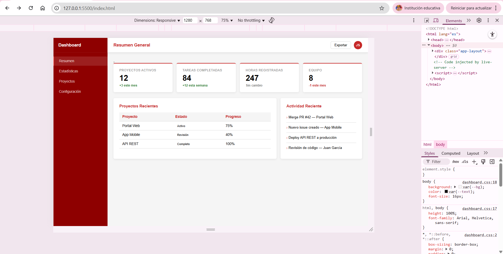
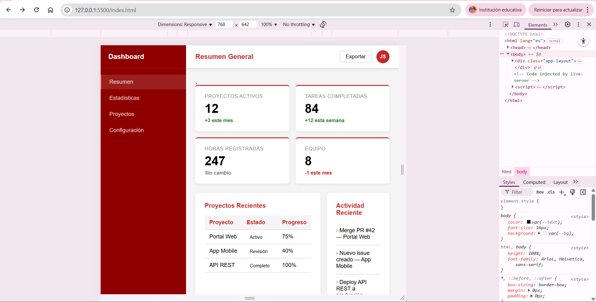

# galvis-post2-u3
Laboratorio: Dashboard con Grid y Flexbox

# Dashboard CSS3 — PostContenido 2

## 👨‍💻 Autor

**Nombre:** Faiber Sleyder Galvis Romero
**Programa:** Ingeniería de Sistemas
**Asignatura:** Programación Web
**Unidad:** CSS3 Básico

---

## Descripción del Proyecto

Este proyecto consiste en el desarrollo de un **dashboard web responsivo** utilizando únicamente **CSS3**, aplicando los modelos modernos de maquetación:

* **CSS Grid** para la estructura principal de la página
* **Flexbox** para la distribución de los componentes internos

El objetivo es demostrar el dominio de técnicas de diseño modernas sin el uso de frameworks externos como Bootstrap o Tailwind.

---

## Estructura del Proyecto

```
apellido-post2-u3/
│
├── index.html
├── css/
│   └── dashboard.css
└── README.md
```

---

## Cómo ejecutar el proyecto

1. Clonar o descargar el repositorio
2. Abrir la carpeta en **Visual Studio Code**
3. Instalar la extensión **Live Server** (si no la tienes)
4. Hacer clic derecho en `index.html`
5. Seleccionar **"Open with Live Server"**

El proyecto se abrirá automáticamente en el navegador.

---

## Funcionalidades implementadas

* Layout principal con **CSS Grid**
* Sidebar (menú lateral) con **Flexbox**
* Topbar (barra superior) alineada con Flexbox
* Tarjetas de estadísticas responsivas
* Tabla de proyectos con estados visuales
* Panel de actividad reciente
* Diseño adaptable a diferentes tamaños de pantalla

---

##  Diseño Responsivo

El dashboard se adapta automáticamente a distintos dispositivos:

* **Pantallas grandes (1280px):**

  * 4 tarjetas en una fila
  * Panel principal (2fr) + panel lateral (1fr)

* **Pantallas medianas (768px):**

  * 2 tarjetas por fila
  * Layout ajustado

* **Pantallas pequeñas:**

  * 1 tarjeta por fila
  * Paneles apilados verticalmente

---

## Tecnologías utilizadas

* HTML5
* CSS3 (Grid + Flexbox)
* Variables CSS (Custom Properties)
* DevTools (para inspección de layout)

---

## Capturas de pantalla

### Vista escritorio (1280px)



### Vista móvil (768px o menor)



---

## Commits realizados

* `feat: estructura HTML del dashboard con 3 áreas (sidebar, topbar, main)`
* `style: grid principal, sidebar flex column, topbar flex space-between`
* `style: stats grid responsivo, content-row 2fr/1fr, tabla y badges`

---

## Restricciones del proyecto

*  No se permite el uso de frameworks CSS externos
* Solo se utiliza CSS puro (Grid y Flexbox)

---

## Notas adicionales

El proyecto fue desarrollado siguiendo buenas prácticas como:

* Uso de nomenclatura BEM
* Código organizado y comentado
* Uso de variables CSS para mantener consistencia visual

---

## Estado del proyecto

✔️ Finalizado y funcional
✔️ Cumple con los requisitos de la actividad
✔️ Publicado en GitHub

---

